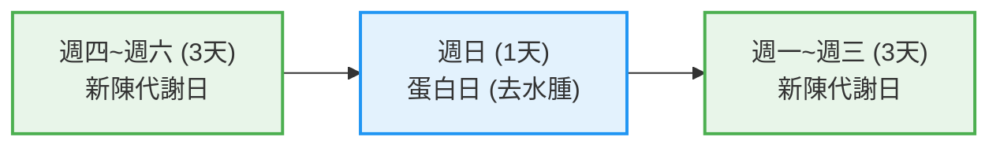

# 第六週飲食與營養補充計畫（diet_plan_week6.md）

> 本文件整合《減重飲食守則》、《八戒原則》與《第六周參考菜單》，為 Rich 與 Carolyn 健管 45 天計畫第六週（衝刺與極限塑造期）執行規範。
> 
> 🔥 **第六週核心亮點（高代謝全開：6天新陳代謝日 + 1天蛋白日）**：
> 本週將新陳代謝日大幅擴展至 **全週 6 天（星期四至六、星期一至三）**，每餐提供 **80g 原型優質穀物**（糙米/五穀飯）穩定補充肌醣與提升基礎代謝，蛋白質肉量升級至 **3~4 兩 (112.5~150g)**，並開放 **生蔬菜不限量**；中間穿插 **週日 1 天純蛋白日** 進行強力去水腫與脂肪燃燒衝刺，為 45 天計畫結案奠定最佳成果！

---

## 🥗 一、減重飲食守則

### 1. 每餐進食順序
1. **第一優先**：蛋白質（以優質原型肉類/蛋為主，如醬牛、醬雞、蝦）
2. **第二順位**：蔬菜（生蔬菜不限量、熟蔬菜每餐 60g）
3. **第三順位**：穀物與水果（原型五穀飯 80g、水果半份）

### 2. 澱粉與穀物控制
- **新陳代謝日（週四～週六、週一～週三）**：三餐皆可進食優質五穀類（糙米飯、五穀米飯，每餐熟重 80g，約平平半碗 / 半拳頭份量）。
- **蛋白日（週日）**：完全不吃澱粉與穀物類，回歸純蛋白質充填與快速排水。

---

## 🚫 二、八戒原則

減重期間必須嚴格遵守「四少」與「四無」：

| 類別 | 守則內容 | 說明 |
| :--- | :--- | :--- |
| **四少** | 1. 少醣 | 減少精緻糖份攝取 |
| | 2. 少碳水化合物 | 蛋白日嚴格禁碳，新陳代謝日僅限優質原型五穀（80g/餐） |
| | 3. 少油 | 低油水煮、清蒸、水煎或少油烹調 |
| | 4. 少鹽 | 清淡調味（肉類煮熟後可沾少許醬油或薄鹽） |
| **四無 (NG)** | 5. 無糖 (NG) | 嚴禁添加糖、含糖飲料與甜點 |
| | 6. 無酒 (NG) | 嚴禁任何酒精飲料 |
| | 7. 無茶 (NG) | 嚴禁各式茶類（除綠茶素補充品外） |
| | 8. 無咖啡 (NG) | 嚴禁含咖啡因飲料 |

---

## 📅 三、第六週參考菜單（7 天結構：6 新陳代謝日 + 1 蛋白日）

---

### 1. 新陳代謝日（3天：星期四、五、六）
> ※ **蛋白質份量**：醬牛 or 醬雞一份約 **3-4 兩 (112.5 - 150g)** 或蝦 8-13 隻。  
> ※ **蔬菜與澱粉**：生蔬菜不限量 + 熟蔬菜 60g + 熟五穀/糙米 80g。

* **07:45**：益生菌 1 條 + 纖維 2-3 粒 + 溫開水 500cc
* **08:00 (早餐)**：水煮蛋 1 個 + **1/2 水果** + **80g 穀物** + 蛋白素 1 匙 + 卵磷脂粉 1 勺 + DX 1 份 + 魚油 1 粒 + 綠茶素 1 粒
* **10:00 (早點心)**：喝蛋白素 1 匙 + 水 300-500cc + 長效B 1 粒 + 加美D鈣片 1 粒
* **11:45**：纖維 2-3 粒 + 溫開水 500cc
* **12:00 (午餐)**：醬牛 or 醬雞 (3-4兩, 112.5-150g) or 蝦 8-13隻 + **生蔬菜不限** + **1/2 水果** + **熟蔬菜 60g** + **80g 穀物** + 蛋白素 1 匙 + 卵磷脂粉 1 勺 + DX 1 份 + 魚油 1 粒 + 綠茶素 1 粒
* **14:00 (午點心)**：喝蛋白素 1 匙（或水煮蛋 1 個）+ 長效B 1 粒 + 加美D鈣片 1 粒
* **16:00 (下午茶)**：喝蛋白素 1 匙（或水煮蛋 1 個）+ 長效B 1 粒 + 加美D鈣片 1 粒
* **17:45**：纖維 2-3 粒 + 溫開水 500cc
* **18:00 (晚餐)**：醬牛 or 醬雞 (3-4兩, 112.5-150g) or 蝦 8-13隻 + **生蔬菜不限** + **1/2 水果** + **熟蔬菜 60g** + **80g 穀物** + 蛋白素 1 匙 + 卵磷脂粉 1 勺 + DX 1 份 + 魚油 1 粒 + 綠茶素 1 粒
* **20:00 (晚補給)**：蛋白素 1 匙 + 水 300-500cc + 長效B 1 粒 + 加美D鈣片 1 粒

---

### 2. 蛋白日（1天：星期日）
> ※ **蛋白質說明**：醬牛、醬雞（約 2 兩的肉煮熟後沾少許醬油 or 鹽）或蝦 8-13 隻。  
> ※ **完全禁碳**：不含穀物與蔬菜，進行極致蛋白質充填與快速排水。

* **07:45**：益生菌 1 條 + 纖維 2-3 粒 + 溫開水 500cc
* **08:00 (早餐)**：水煮蛋 1 個 + 蛋白素 1 匙 + 卵磷脂粉 1 勺 + DX 1 份 + 魚油 1 粒 + 綠茶素 1 粒
* **10:00 (早點心)**：喝蛋白素 1 匙 + 水 300-500cc + 長效B 1 粒 + 加美D鈣片 1 粒
* **11:45**：纖維 2-3 粒 + 溫開水 500cc
* **12:00 (午餐)**：醬牛 or 醬雞 (約2兩) or 蝦 8-13隻 + 蛋白素 1 匙 + 卵磷脂粉 1 勺 + DX 1 份 + 魚油 1 粒 + 綠茶素 1 粒
* **14:00 (午點心)**：喝蛋白素 1 匙（或水煮蛋 1 個）+ 長效B 1 粒 + 加美D鈣片 1 粒
* **16:00 (下午茶)**：喝蛋白素 1 匙（或水煮蛋 1 個）+ 長效B 1 粒 + 加美D鈣片 1 粒
* **17:45**：纖維 2-3 粒 + 溫開水 500cc
* **18:00 (晚餐)**：醬牛 or 醬雞 (約2兩) or 蝦 8-13隻 + 蛋白素 1 匙 + 卵磷脂粉 1 勺 + DX 1 份 + 魚油 1 粒 + 綠茶素 1 粒
* **20:00 (晚補給)**：若餓了可喝蛋白素 1 匙 + 水 300-500cc + 長效B 1 粒 + 加美D鈣片 1 粒

---

### 3. 新陳代謝日（3天：星期一、二、三）
> ※ **蛋白質份量**：醬牛 or 醬雞一份約 **3-4 兩 (112.5 - 150g)** 或蝦 8-13 隻。  
> ※ **蔬菜與澱粉**：生蔬菜不限量 + 熟蔬菜 60g + 熟五穀/糙米 80g。

* **07:45**：益生菌 1 條 + 纖維 2-3 粒 + 溫開水 500cc
* **08:00 (早餐)**：水煮蛋 1 個 + **1/2 水果** + **80g 穀物** + 蛋白素 1 匙 + 卵磷脂粉 1 勺 + DX 1 份 + 魚油 1 粒 + 綠茶素 1 粒
* **10:00 (早點心)**：喝蛋白素 1 匙 + 水 300-500cc + 長效B 1 粒 + 加美D鈣片 1 粒
* **11:45**：纖維 2-3 粒 + 溫開水 500cc
* **12:00 (午餐)**：醬牛 or 醬雞 (3-4兩, 112.5-150g) or 蝦 8-13隻 + **生蔬菜不限** + **1/2 水果** + **熟蔬菜 60g** + **80g 穀物** + 蛋白素 1 匙 + 卵磷脂粉 1 勺 + DX 1 份 + 魚油 1 粒 + 綠茶素 1 粒
* **14:00 (午點心)**：喝蛋白素 1 匙（或水煮蛋 1 個）+ 長效B 1 粒 + 加美D鈣片 1 粒
* **16:00 (下午茶)**：喝蛋白素 1 匙（或水煮蛋 1 個）+ 長效B 1 粒 + 加美D鈣片 1 粒
* **17:45**：纖維 2-3 粒 + 溫開水 500cc
* **18:00 (晚餐)**：醬牛 or 醬雞 (3-4兩, 112.5-150g) or 蝦 8-13隻 + **生蔬菜不限** + **1/2 水果** + **熟蔬菜 60g** + **80g 穀物** + 蛋白素 1 匙 + 卵磷脂粉 1 勺 + DX 1 份 + 魚油 1 粒 + 綠茶素 1 粒
* **20:00 (晚補給)**：蛋白素 1 匙 + 水 300-500cc + 長效B 1 粒 + 加美D鈣片 1 粒

---

## 💡 四、重要小叮嚀

1. **穀物選擇**：穀物可以任選糙米飯、五穀米飯等原型高纖全穀類（每餐熟重 80g，約平平半碗 / 半拳頭）。
2. **水分、步數與蛋白質**：每天喝 **2000-3000cc 的水** + 走 **10,000 步** 的路 + 至少 **6 匙的蛋白素**。
3. **補充品彈性調整**：魚油、維生素B群、維生素C、CaMg 因個人體質可加量。
4. **進食與斷食原則**：以不讓自己餓為原則，餓了就喝蛋白素；**晚上 8 點以後不進食**。
5. **極致控糖與代謝日說明**：期間不吃精緻醣類、茶和含咖啡因飲料，**唯有新陳代謝日才可適度進食五穀類**。
6. **禁忌提醒**：若有心臟疾病、癌症、腎臟疾病或肝炎患者不建議施行。
7. **醫療聲明**：本健康管理計畫非屬醫療行為，請勿自行停用醫生開立藥物。
8. **替代方案**：DX 若暫時缺貨，可以用「得力 1 粒 + C 1 粒」取代。

---

## 📊 五、第六週營養補充品總需求統計表

> 註：下表提供「單人每日攝取量」、「單人第六週（7天）總需求」與「雙人（Rich + Carolyn）第六週總備貨需求」，方便進行備貨與日常分裝。

| 營養素 / 補充品品名 | 每次補充份量 | 每日補充時段 | 每日單人份數 | **單人第六週總量 (7天)** | **雙人第六週總量 (Rich+Carolyn)** | 主要功能與補充目的 |
| :--- | :--- | :--- | :--- | :--- | :--- | :--- |
| **蛋白素 (All Plant Protein)** | 1 匙 / 次 | 08:00, 10:00, 12:00, 14:00, 16:00, 18:00, 20:00 | 6 ～ 7 匙 | **48 ～ 49 匙** | **96 ～ 98 匙** | 提供優質植物蛋白、維持肌肉量、抗飢餓 |
| **益生菌 (Probiotics)** | 1 條 / 次 | 07:45 (晨間空腹) | 1 條 | **7 條** | **14 條** | 維持腸道菌叢平衡、幫助消化吸收與順暢 |
| **複合植物纖維嚼片/粉 (Fiber)** | 2～3 粒 / 次 | 07:45, 11:45, 17:45 (餐前) | 6 ～ 9 粒 | **42 ～ 63 粒** | **84 ～ 126 粒** | 補充膳食纖維、穩定血糖波動、促進蠕動 |
| **卵磷脂粉 (Lecithin)** | 1 勺 / 次 | 08:00, 12:00, 18:00 (三餐中) | 3 勺 | **21 勺** | **42 勺** | 促進脂肪乳化代謝、保護血管與肝臟健康 |
| **DOUBLE X 綜合營養片 (DX)** | 1 份 / 次 | 08:00, 12:00, 18:00 (三餐中) | 3 份 | **21 份** | **42 份** | 提供全方位必需維生素、礦物質與植物濃縮素 |
| **深海魚油 (Omega-3 Fish Oil)** | 1 粒 / 次 | 08:00, 12:00, 18:00 (三餐中) | 3 粒 | **21 粒** | **42 粒** | 提供優質 Omega-3、抗發炎、促進脂質代謝 |
| **綠茶素 / 複合綠茶膠囊** | 1 粒 / 次 | 08:00, 12:00, 18:00 (三餐中) | 3 粒 | **21 粒** | **42 粒** | 補充高濃度 EGCG、啟動產熱效應與脂肪代謝 |
| **長效維生素 B 群 (B Complex)** | 1 粒 / 次 | 10:00, 14:00, 16:00, 20:00 | 4 粒 | **28 粒** | **56 粒** | 能量代謝輔酶、維持高基礎代謝率 |
| **加美 D 鈣片 (CaMgD)** | 1 粒 / 次 | 10:00, 14:00, 16:00, 20:00 | 4 粒 | **28 粒** | **56 粒** | 補充鈣鎂 D3、穩定神經肌肉、強化脂肪代謝 |
